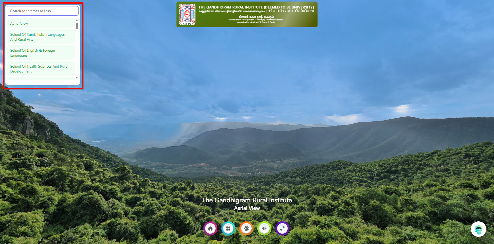

# 🔍 Search-JS – Smart Search for Virtual Tour Projects

**Search-JS** is a lightweight, plug-and-play JavaScript widget that adds a beautiful, fast, and dynamic search box to your **Virtual Tour** web apps. It helps users search through panorama titles and external links in real-time — ideal for **campus tours, exhibitions, smart city apps, tourism showcases**, and more.



---

## 🚀 Features

* 🔎 Dynamic search for panorama names (auto-detected from locale file)
* 🌐 Supports external project links via `Links.txt`
* 💡 Smart suggestion box with clickable actions
* 📱 Mobile-friendly UI
* 🎨 Clean and modern design (no external libraries)

---

## 🛠️ How It Works

* Panorama titles are loaded automatically from `locale/en.txt`
* You can **add external search options** by creating a `Links.txt` file
* Users can:

  * Click on a panorama name to jump to that location in the tour
  * Click on a link to open external resources in a new tab

---

## 📁 Folder Structure

```
Search-js/
│
├── index.html         # Your tour HTML page
├── search.js          # This widget (or inline script)
├── locale/
│   └── en.txt         # Contains your panorama titles
├── Links.txt          # Optional file for external search links
└── README.md
```

---

## 📌 Setup Instructions

### 1. Add the Script

You can copy and paste the following code into your tour's HTML file or link it as `search.js`.

```html
<script src="search.js" defer></script>
```

Or paste the script directly inside `<script>...</script>` in your HTML file.

---

### 2. Provide `locale/en.txt`

Create a folder named `locale` and inside it, add a file `en.txt`. It should include lines like:

```
panorama_CAMPUS_LIBRARY.label = Library
panorama_ADMIN_BUILDING.label = Administration Block
panorama_MAIN_GATE.label = Main Entrance
```

These names will be auto-scanned and shown in the search dropdown.

---

### 3. (Optional) Add `Links.txt`

To enable external link search options, create a file `Links.txt` in the same directory with the following format:

```
SCHOOL OF MANAGEMENT STUDIES = https://www.ruraluniv.ac.in/soms
HOSTEL FACILITIES = https://www.ruraluniv.ac.in/hostel
ONLINE ADMISSION = https://admissions.ruraluniv.ac.in/
```

Each line must follow this format:

```
<Display Name> = <URL>
```

---

## 🧪 3D Vista Integration

You can directly use this with **3DVista** using the **Action > Execute JavaScript** option.

Paste the following code:

```js
function loadSearchScript() {
  const script = document.createElement('script');
  script.src = "https://cdn.jsdelivr.net/gh/thiyo-de/Search-js@latest/search.js";
  script.async = true;
  document.head.appendChild(script);
}

loadSearchScript();
```

This will dynamically load the search feature from the latest version of this repo via CDN.

---

## 📸 Screenshot


*Use a real preview here to demonstrate the UI.*

---

## 🧲 Example Usage

Once integrated, the search box will appear in the top-left corner:

* Typing `Library` will show a matching panorama
* Typing `Hostel` will show a link to that facility
* Clicking a result will:

  * Navigate to panorama if in a tour
  * Open link in new tab if it’s an external link

---

## 🔧 Script Logic Overview

1. **Creates a floating search container** and styles it
2. **Loads `locale/en.txt`** and extracts all panorama labels
3. **Loads `Links.txt`** and parses them into title-URL objects
4. **Monitors input**, filters and displays matched items
5. **Handles click actions**:

   * For panoramas: calls `tour.setMediaByName(title)`
   * For links: opens in a new browser tab
6. **Displays list on focus** and **hides it on outside click**

---

## 👨‍💻 Developer Notes

* If `tour` is not defined, a simple alert is shown
* The list auto-hides when clicking outside the widget
* Simple DOM-based approach — no dependencies

---

## 🌍 Perfect For

* Campus & college virtual tours
* Tourist attractions & monuments
* Museum walkthroughs
* Smart city platforms
* Art exhibitions & gallery showcases

---

## 🧹 Demo File Example

Here’s what your `Links.txt` might look like:

```
DEPARTMENT OF COMPUTER SCIENCE = https://www.ruraluniv.ac.in/cs
UNIVERSITY HOSTEL = https://www.ruraluniv.ac.in/hostel
PLACEMENT CELL = https://www.ruraluniv.ac.in/placement
```

And your `locale/en.txt`:

```
panorama_UNIVERSITY_ENTRANCE.label = University Main Entrance
panorama_LIBRARY_HALL.label = Library
panorama_ADMIN_BLOCK.label = Administration Building
```

---

## 📩 Contribute

Want to improve or customize? Fork this repo and make a pull request!

📌 GitHub Repo: [https://github.com/thiyo-de/Search-js](https://github.com/thiyo-de/Search-js)

---

## 📄 License

MIT License — Free for personal and commercial use.
Attribution is appreciated but not required. ✨
